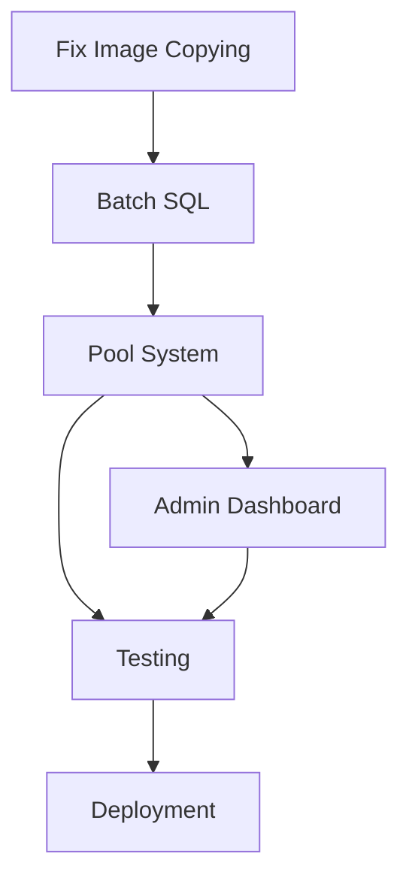

# Campaign Pool System - Implementation Tasks

## Phase 1: Fix Current Image Copying [2 days]

### Fix Attachment Timing
- [ ] Move image attachment in SchtickDuplicatorService to AFTER save
- [ ] Move image attachment in WeaponDuplicatorService to AFTER save
- [ ] Add image attachment method that works on persisted records
- [ ] Test with full master template (643 schticks with images)

### Optimize Image Handling
- [ ] Investigate sharing ImageKit URLs instead of copying files
- [ ] Test if multiple schticks can reference same image_url
- [ ] Implement shared blob approach if ImageKit supports it
- [ ] Document ImageKit URL sharing strategy

### Add Resilience
- [ ] Implement retry logic for ImageKit operations
- [ ] Add connection recovery for nil connection errors
- [ ] Add comprehensive error logging
- [ ] Test connection recovery under load

## Phase 2: Batch SQL Implementation [3 days]

### Batch Creation Services
- [ ] Create CampaignBatchSeederService
- [ ] Implement batch_create_schticks method (single INSERT for all)
- [ ] Implement batch_create_weapons method
- [ ] Handle prerequisites in separate UPDATE pass
- [ ] Share image URLs instead of creating new blobs

### Image URL Sharing
- [ ] Map source schtick images to target schticks
- [ ] Create attachments pointing to same ImageKit URLs
- [ ] Test that shared URLs work correctly
- [ ] Verify no duplicate ImageKit uploads needed

### Performance Testing
- [ ] Benchmark current vs batch performance
- [ ] Test with production data volume
- [ ] Verify transaction atomicity
- [ ] Document performance gains

## Phase 3: Campaign Pool System [5 days]

### Database Updates
- [ ] Add migration for is_pool boolean on campaigns
- [ ] Add activated_at timestamp
- [ ] Add pool_type field (master/user)
- [ ] Add pool_created_at to track when pool campaign was created
- [ ] Add indexes for pool queries
- [ ] Add pool_status to track health

### Pool Service
- [ ] Create CampaignPoolService
- [ ] Implement find_available_pool method
- [ ] Implement assign_pool_campaign method
  - [ ] Update campaign name and description
  - [ ] Reset created_at to current time
  - [ ] Reset updated_at to current time
  - [ ] Set activated_at to current time
  - [ ] Transfer ownership if from master pool
  - [ ] Clear is_pool flag
- [ ] Add pool size configuration
- [ ] Create pool metrics methods

### Timestamp Management
- [ ] Store original pool creation time in pool_created_at
- [ ] Reset created_at and updated_at on assignment
- [ ] Ensure all child records appear fresh
- [ ] Test that campaign appears newly created to user
- [ ] Verify campaign shows correct date in UI

### Replenishment System
- [ ] Create CampaignPoolReplenishJob
- [ ] Implement master pool replenishment
- [ ] Implement user pool creation
- [ ] Add replenishment triggers
- [ ] Configure job scheduling

### Controller Integration
- [ ] Update CampaignsController#create
- [ ] Add pool assignment logic
- [ ] Trigger replenishment on assignment
- [ ] Add fallback to traditional creation
- [ ] Update response format

## Phase 4: Admin Dashboard [3 days]

### Dashboard Backend
- [ ] Create Admin::DashboardController
- [ ] Add pool status endpoint
- [ ] Create performance metrics endpoint
- [ ] Add quick action endpoints
- [ ] Implement authentication/authorization

### Dashboard Frontend
- [ ] Create dashboard layout
- [ ] Add pool status cards
- [ ] Implement real-time updates via ActionCable
- [ ] Add performance charts
- [ ] Create quick action buttons
- [ ] Show pool age vs activated age

### Monitoring & Alerts
- [ ] Create PoolMonitorJob
- [ ] Add low pool detection
- [ ] Implement email alerts
- [ ] Add Slack notifications (optional)
- [ ] Create health check endpoint

## Phase 5: Testing & Deployment [2 days]

### Testing
- [ ] Unit tests for batch services
- [ ] Integration tests for pool system
- [ ] Test timestamp reset functionality
- [ ] Load testing with concurrent users
- [ ] Test pool exhaustion scenarios
- [ ] Verify image URL sharing works

### Documentation
- [ ] Document pool configuration
- [ ] Create operations runbook
- [ ] Write troubleshooting guide
- [ ] Update API documentation
- [ ] Document ImageKit URL sharing approach
- [ ] Document timestamp management strategy

### Deployment
- [ ] Deploy to staging environment
- [ ] Run acceptance tests
- [ ] Create rollback plan
- [ ] Deploy to production
- [ ] Monitor initial usage

## Phase 6: Post-Launch [Ongoing]

### Optimization
- [ ] Analyze pool usage patterns
- [ ] Optimize pool sizes
- [ ] Fine-tune replenishment timing
- [ ] Monitor ImageKit costs with URL sharing

### Maintenance
- [ ] Set up automated pool cleanup
- [ ] Monitor storage costs
- [ ] Track performance metrics
- [ ] Gather user feedback

## Task Dependencies

## Definition of Done

Each task is complete when:
- Code is written and reviewed
- Tests are passing
- Documentation is updated
- Performance is verified
- Deployed to staging

## Special Considerations

### ImageKit URL Sharing
Since images are stored on ImageKit, we can optimize by:
1. **Sharing URLs**: Multiple schticks can reference the same ImageKit URL
2. **No File Copying**: Skip actual file duplication on ImageKit
3. **Instant Images**: New campaigns get images immediately via shared URLs
4. **Cost Savings**: Reduced ImageKit storage and bandwidth usage

This approach means:
- Schtick A (master) has image at `imagekit.io/abc123.jpg`
- Schtick B (new campaign) references same `imagekit.io/abc123.jpg`
- No new upload, no copy operation, instant availability

### Timestamp Management
When assigning a pool campaign to a user:
1. **Keep pool_created_at**: Track when pool campaign was actually created
2. **Reset created_at**: Set to current time so user sees "Created today"
3. **Reset updated_at**: Set to current time for consistency
4. **Set activated_at**: Mark when campaign was assigned from pool
5. **User Experience**: Campaign appears freshly created from user's perspective